# 500px

#### A CRUD application that allows users to create, edit, and delete photo albums. A comment section appears for each image inside the photo album allowing users to share their thoughts on photos!

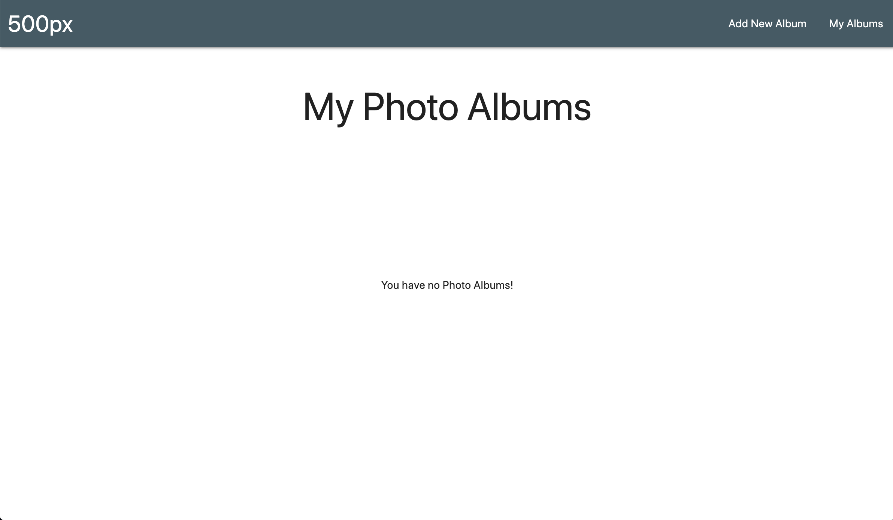
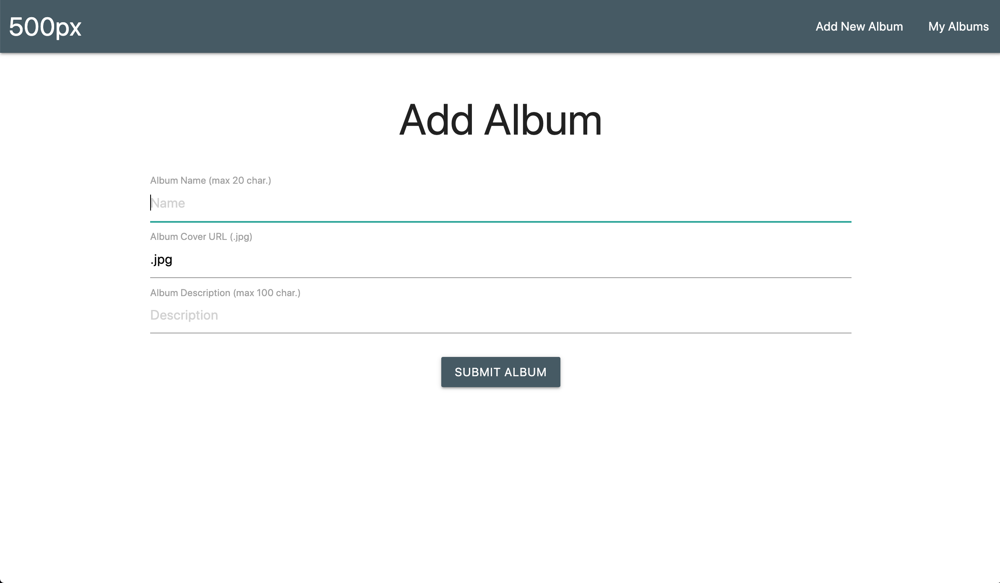
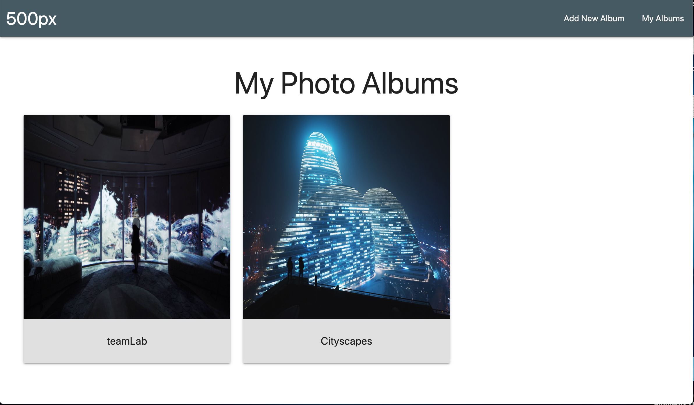
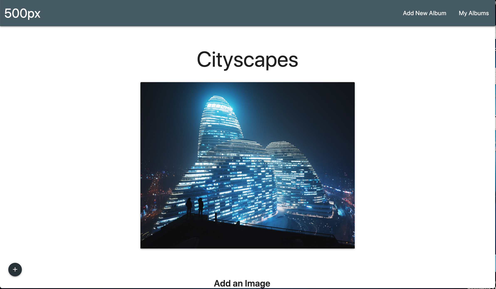
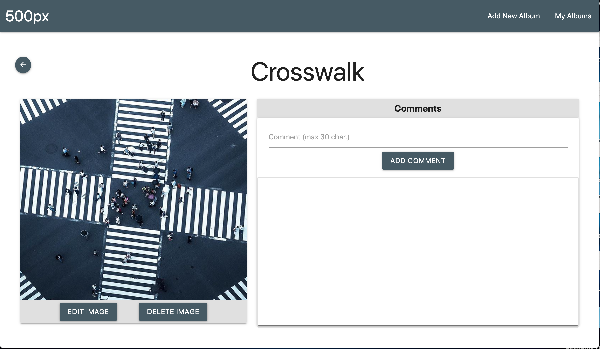
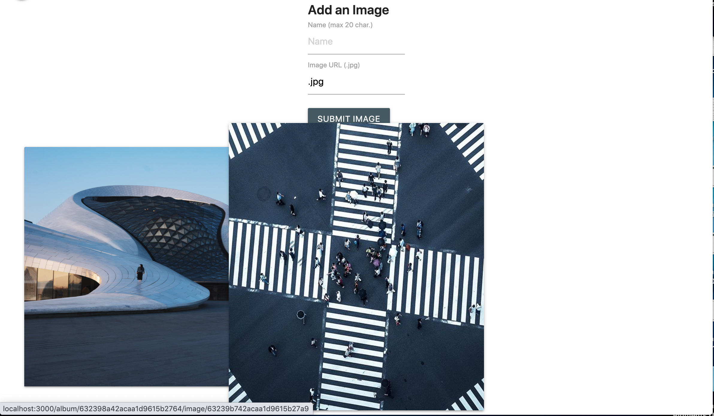
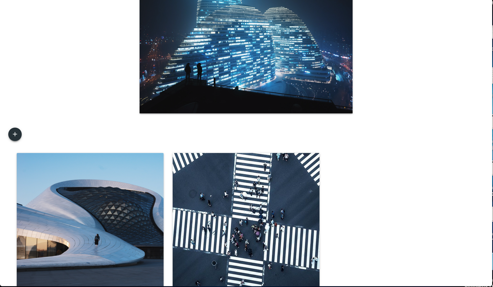
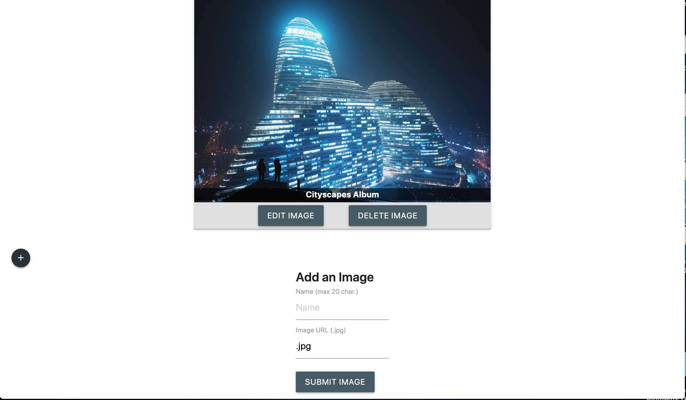
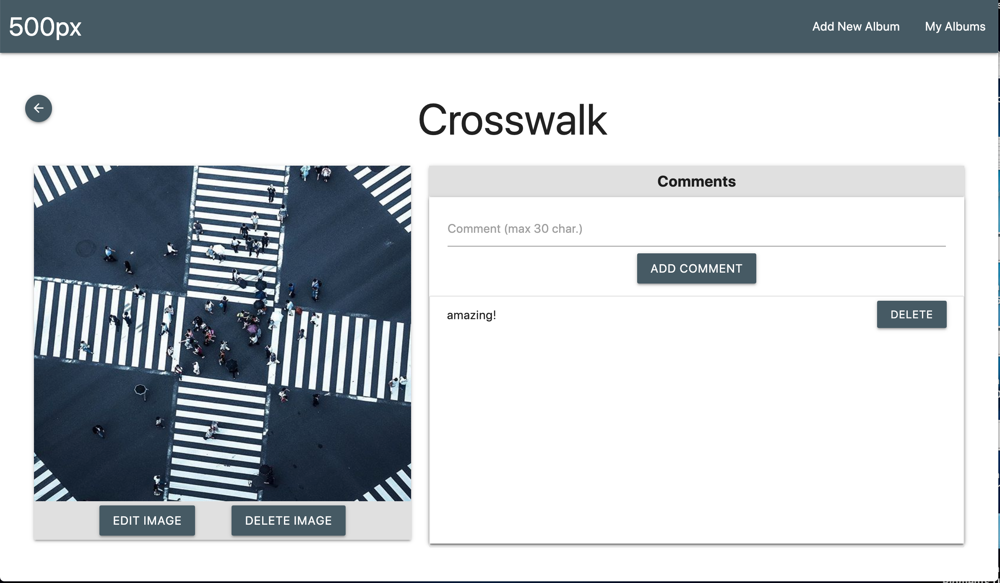

## Table of Contents
- [Technologies Used](#technologiesused)
- [Features](#features)
- [Wireframe](#wireframe)
- [Trello](#trello)
- [Deployed App](#deployment)
- [Resources](#resources)
- [Future Implementations](#futureimplementations)

##  Technologies Used
- Node.js
- Mongoose & MongoDB
- EJS
- JavaScript
- HTML
- CSS
- Materialize

##  Features
- Users can Create Update Edit and Delete a photo Album
- Users can Create Update Edit and Delete singe Images in a photo Album
- Users can Create and Delete Comments on an Image
- Hovering over a Cover Image will reveal its Description and buttons to Edit and Delete the entire Album
- Mobile friendly

##  Wireframe
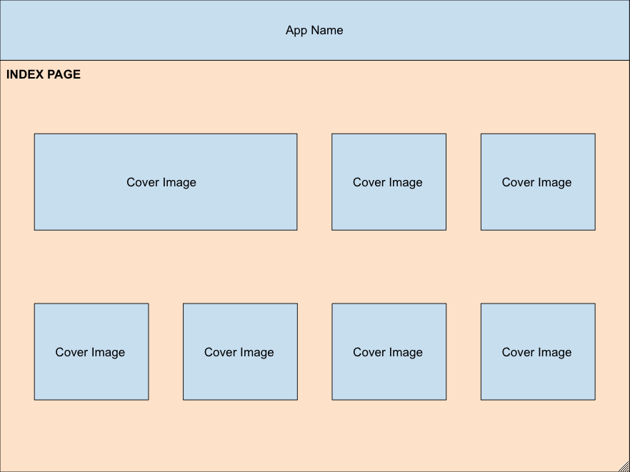
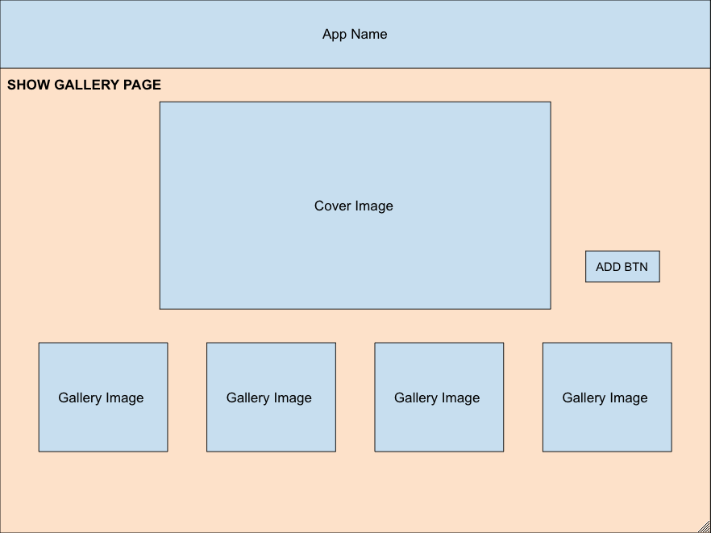
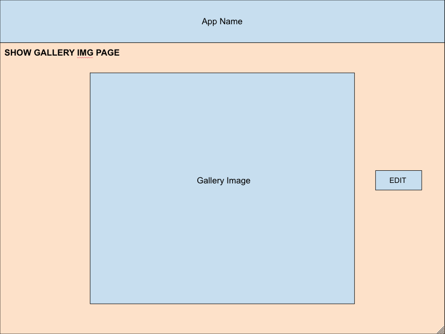
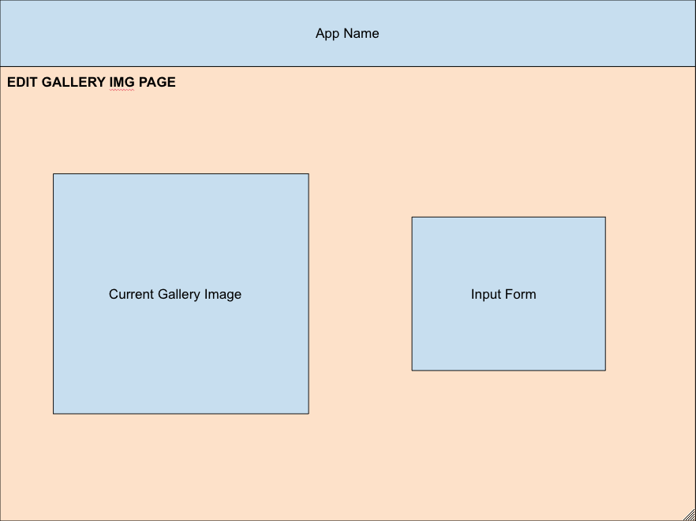

##  Trello
- [Trello](https://trello.com/b/LMywPsTV/500px)

##  Deployed Link
- [Heroku](https://peter-lam-500px.herokuapp.com/)

##  Resources:
- [MDN](https://developer.mozilla.org/en-US/)
- [w3schools](https://www.w3schools.com/)
- [StackOverflow](https://stackoverflow.com/)
- [Materialize](https://materializecss.com/)
- [500px](https://500px.com/)

##  Future Implementations
- Authentication
- Use Multer & GridFS to let users upload images and store data in MongoDB
